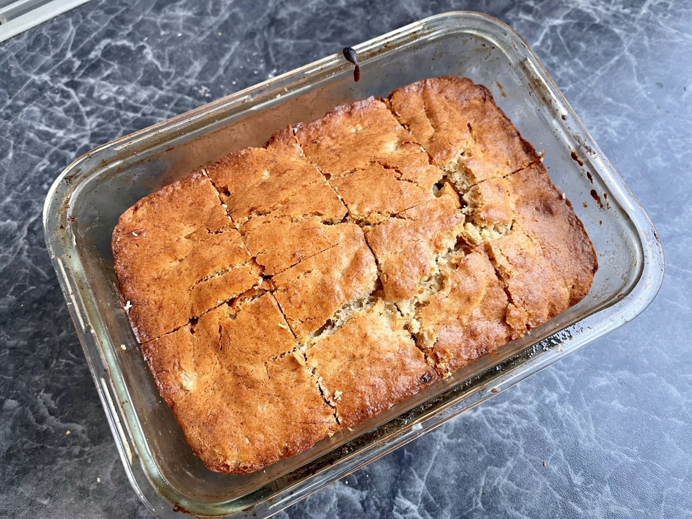

# Banana Cake
> 經典香蕉蛋糕

## Recipe

<lite-youtube videoid="_Pw-U2057Og" />

## Ingredients

* 香蕉 Banana — 2支
* 雞蛋 Eggs — 1個
* 奶油 Butter — 70g
* 堅果 Nuts — 50g
* 糖 Sugar — 60g
* 低筋麵粉 Cake flour — 150g
* 泡打粉 Baking powder — 5g

## Photos

