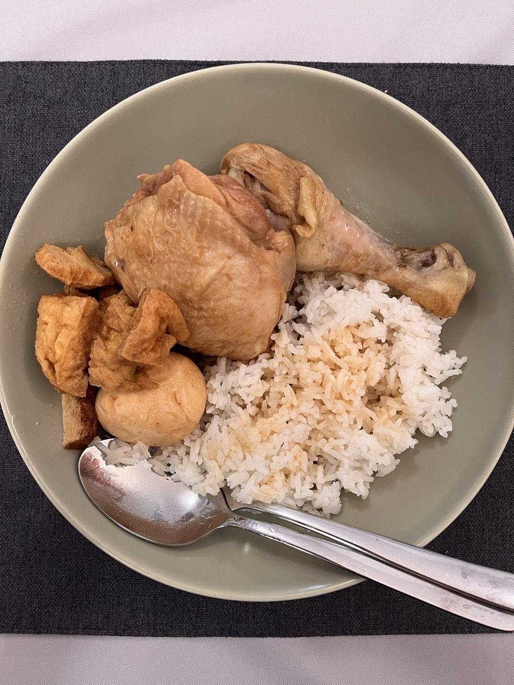

# Braised Chicken Drumsticks
> 姆士流便當菜: 簡單版滷雞腿

## Recipe

<lite-youtube videoid="mdTNmwtbfYw" />

## Ingredients

> ✨ Generated using Google Gemini. _Gemini can make mistakes, so double-check it._

- Chicken drumsticks
- Scallions (1 stalk)
- Ginger (old ginger, smashed)
- Red shallots (4-5 pieces, smashed)
- Oyster sauce
- Cooking wine
- Soy sauce
- Water
- Sesame oil
- White pepper
- Salt (about half a teaspoon, adjust to taste)
- Sugar

## Steps

> ✨ Generated using Google Gemini. _Gemini can make mistakes, so double-check it._

1. **Prepare the chicken:** Make a cut along the bone of the chicken drumsticks to help them cook evenly and absorb flavor.

2. **Pan-fry the chicken skin:** Heat a pan with a little oil. Once hot, reduce the heat and pan-fry the chicken skin until it's slightly crispy and golden brown. This adds fragrance to the braising liquid. If you're making a large batch and can't pan-fry each piece, you can briefly blanch the chicken instead.

3. **Sauté aromatics:** Using the residual chicken fat and oil in the pan, add smashed scallions, ginger, and red shallots. Sauté until fragrant.

4. **Add seasonings and water:** Add oyster sauce, cooking wine, soy sauce (make the flavor a bit stronger initially), water, sesame oil, white pepper, salt, and sugar. Bring the mixture to a boil.

5. **Braise the chicken:** Once the liquid is boiling, add the pan-fried chicken drumsticks. Reduce the heat to a small simmer (do not let it boil vigorously) and braise for about 15-20 minutes. The exact time may vary depending on the size of the chicken.

6. **Soak for flavor:** After braising, remove the chicken from the heat and let it soak in the braising liquid for another 10 minutes, or longer if you desire a deeper flavor. To get a fully infused flavor and tender texture, let the chicken cool down completely in the braising liquid, then refrigerate it overnight. This also helps achieve a Q (chewy) texture.

## Photos

