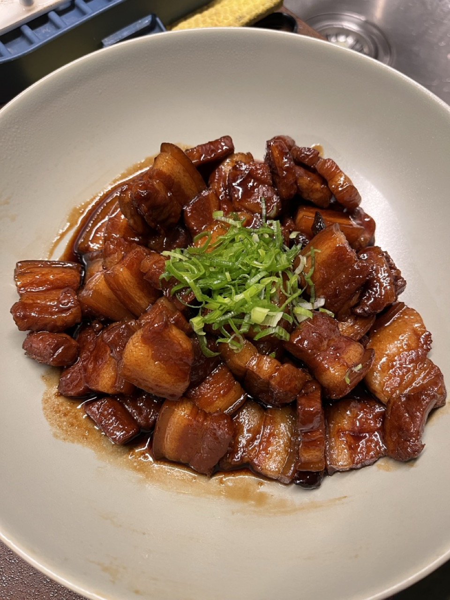

# Braised Pork Belly
> 紅燒肉

## Recipe

<lite-youtube videoid="LHcgQOw8wCU" />

[kwokspots.com: Chinese Braised Pork Belly (Hong Shao Rou)](https://kwokspots.com/chinese-braised-pork-belly-hong-shao-rou/)

## Ingredients

> ✨ Generated using Google Gemini. _Gemini can make mistakes, so double-check it._

- 2 lbs pork belly
- ⅓ cup water
- 50 g rock or brown sugar
- 3 slices ginger
- 3 cloves garlic
- 2 bay leaves
- 2 star anise
- 3 tbsp shaoxing rice wine
- 2 tbsp soy sauce
- 2½ tbsp dark soy sauce
- 3 cups water
- green onions (for topping)

## Steps

> ✨ Generated using Google Gemini. _Gemini can make mistakes, so double-check it._

1. Cut the pork belly into 1½ inch cubes.

2. Boil the pork belly in water for 10 minutes to remove impurities.

3. Strain and quickly rinse the pork belly.

4. In a deep pan over medium heat, add ⅓ cup water and the rock or brown sugar. Cook until the sugar melts and begins to caramelize.

5. Add the boiled pork belly, ginger, and garlic to the pan and stir for 2 minutes.

6. Add the shaoxing rice wine, soy sauce, dark soy sauce, star anise, and bay leaves. Then, add 3 cups of water to braise the pork belly.

7. Cover the pan with a lid and keep it over medium-low heat for 1½ hours, or until the pork is extremely tender. If the pan has too little water at any point, add more.

8. Once the pork belly is tender, remove the lid, raise the heat to medium-high, and let the sauce thicken for 5-10 minutes until it coats the pork belly well.

9. Serve the dish on top of rice and top with green onions.

## Photos

