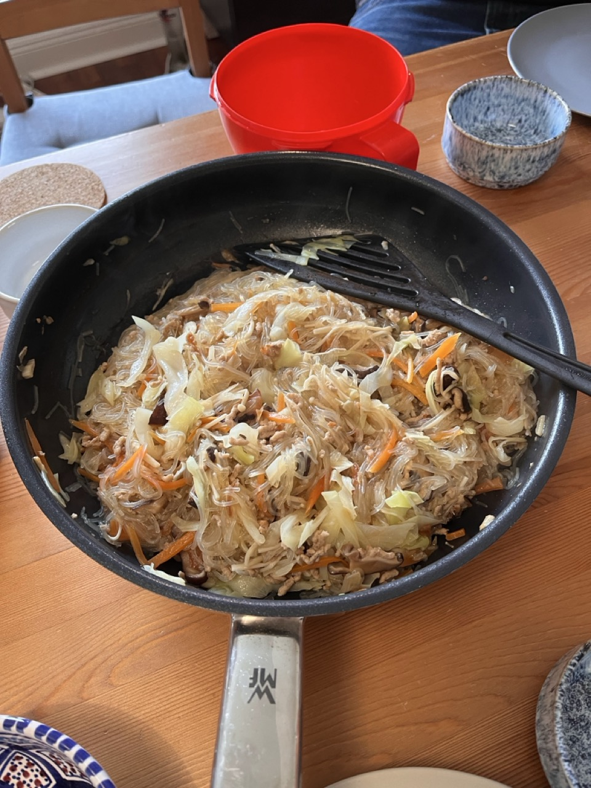

# Stir Fried Glass Noodle
> 家常炒冬粉

## Recipe

<lite-youtube videoid="AJAQMrs3NQA" />

Here's the recipe for stir-fried glass noodles (冬粉) from the video:

## Ingredients

> ✨ Generated using Google Gemini. _Gemini can make mistakes, so double-check it._

* Glass noodles (冬粉) (Amount not specified, but enough to absorb the liquid from 2 cups of water/stock)
* Cabbage (高麗菜) (cut into roughly 1 cm strips)
* Carrots (紅蘿蔔) (cut into thick strips)
* Pork loin (前腿肉絲) (shredded)
* Dried shiitake mushrooms (乾香菇) (rehydrated and sliced into thin strips)
* Dried shrimp (金鉤蝦) (small or large, for fragrance)
* Fried shallots (油蔥酥) (store-bought, for aroma)
* Garlic (蒜頭) (a few cloves, minced or sliced, optional)
* Oil (2 tablespoons)
* Cooking wine or rice wine (米酒) (1 tablespoon, for deglazing)
* Soy sauce (醬油) (2 tablespoons)
* Black vinegar (烏醋) (1 tablespoon)
* Water (2 rice cooker cups)
* White pepper powder (白胡椒粉) (1/3 teaspoon)
* Brown sugar (二砂糖) (1 teaspoon)

## Steps

> ✨ Generated using Google Gemini. _Gemini can make mistakes, so double-check it._

1.  **Prepare Glass Noodles:** If not in a rush, soak the glass noodles in cold water for about 30 minutes until they are soft and rehydrated. This improves the texture.

2.  **Prepare Ingredients:**
    * Cut cabbage into roughly 1 cm thick strips.
    * Cut carrots into thick strips (avoid cutting too thin, as they might break during cooking).
    * Slice rehydrated dried shiitake mushrooms into thin strips.

3.  **Sauté Aromatics:**
    * Heat 2 tablespoons of oil in a pan over high heat.
    * Add garlic (if using) and stir-fry for about 20 seconds until fragrant.
    * Add the sliced shiitake mushrooms and stir-fry for about 30 seconds.
    * Add the dried shrimp and stir-fry for another 30 seconds until fragrant.

4.  **Cook Pork and Vegetables:**
    * Add the shredded pork (no need to marinate if using front leg pork loin) and stir-fry for about 30 seconds until about 80% cooked and slightly browned.
    * Add the carrot strips and stir-fry for about 30 seconds to remove any raw taste.
    * Add the cabbage. Turn off the heat.
    * Add 1 tablespoon of cooking wine along the edge of the pan to deglaze and enhance the aroma.

5.  **Add Fried Shallots and Seasoning:**
    * Turn the heat back to high. Stir-fry the cabbage briefly to get some "wok hei" (wok aroma).
    * Add the fried shallots and stir-fry for about 20 seconds.
    * Turn off the heat again for seasoning.
    * Add 2 tablespoons of soy sauce, 1 tablespoon of black vinegar, and 2 rice cooker cups of water.

6.  **Braise and Absorb:**
    * Turn the heat back to high and bring the liquid to a boil.
    * Add 1/3 teaspoon of white pepper powder and 1 teaspoon of brown sugar. Let it boil to meld the flavors.
    * Once the liquid is boiling, add the soaked glass noodles. Stir to ensure the noodles are fully submerged and absorb the liquid.
    * Boil for 1 minute, then turn off the heat.
    * Cover the pan with a lid (if available) and let it sit for 2-3 minutes to allow the glass noodles to fully absorb the sauce. If you don't have a lid, simply let it sit for 2-3 minutes.

7.  **Finish and Serve:**
    * After the resting period, turn the heat back to high. Stir-fry the glass noodles briefly to evaporate any remaining liquid and ensure the noodles are fully coated and fragrant. This final stir-frying step helps the noodles absorb the sauce even more and prevents them from being too wet.
    * Once the liquid is mostly absorbed (after about 1 minute of high-heat stir-frying), turn off the heat and serve immediately.

## Photos

