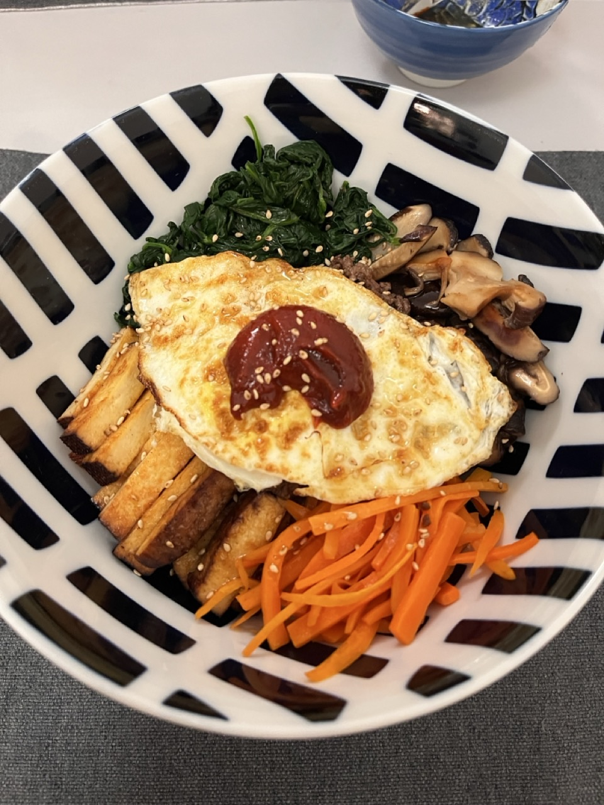
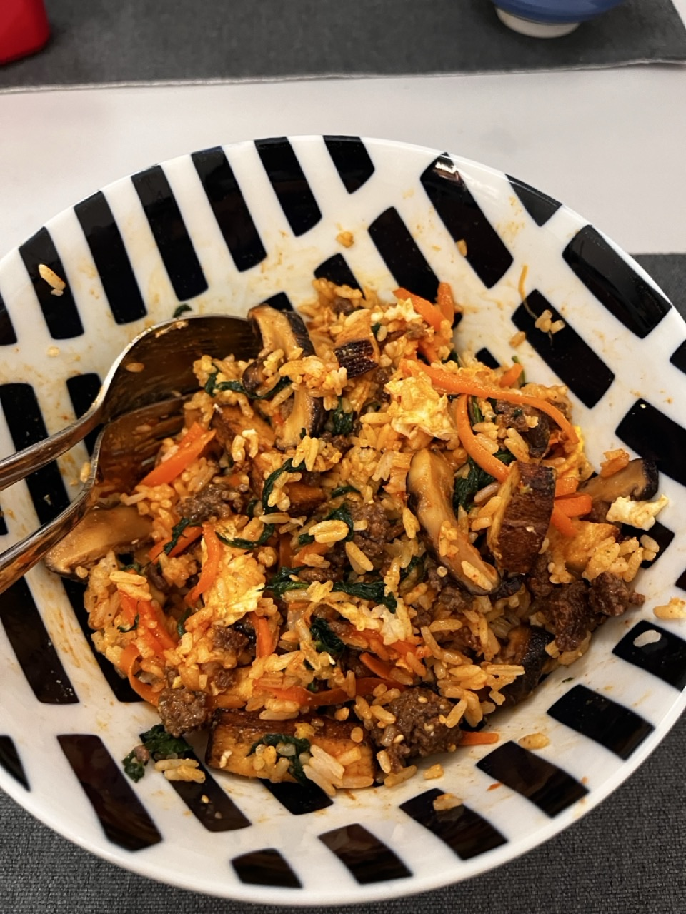

# Bibimbap
> Korean mixed rice with meat and vegetables

## Recipe

<lite-youtube videoid="2JDvGf5K6_0" />

## Henry's Note

In the last step, instead of sesame oil, replace it with [butter](https://www.instagram.com/reel/DOdRomBEmnu/) (Recipe from _Bon Appétit, Your Majesty_).

## Photos

