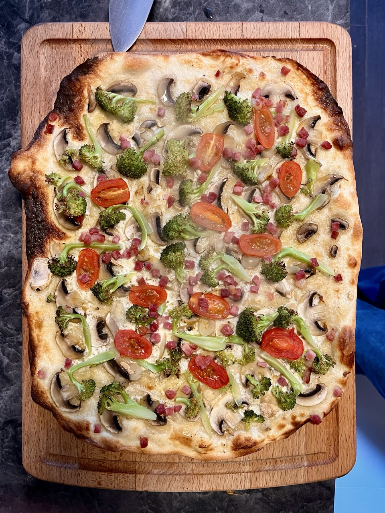

# Flammkuchen
> German Pizza

## Recipe

[chefkoch.de - Einfacher Flammkuchen](https://www.everyday-delicious.com/flammkuchen/)

## Ingredients

> ✨ Generated using Google Gemini. _Gemini can make mistakes, so double-check it._

**For the dough:**

* 2 cups (250g) all-purpose flour
* 1/2 cup (120g) very warm water
* 2 tablespoons olive oil
* 1/2 teaspoon fine sea salt

**For the topping:**

* 1/2 cup (150g) creme fraiche
* 7 oz (200g) thick-cut bacon or German Speck
* 1 small/medium onion
* Chives to garnish (optional)

## Steps

> ✨ Generated using Google Gemini. _Gemini can make mistakes, so double-check it._

1.  **Make the dough:** Preheat the oven to its highest setting (about 500°F/250°C). In a medium or large mixing bowl, stir the flour with salt. Add the olive oil and very warm water and stir with a wooden spoon until roughly combined. Knead the dough by hand or with a stand mixer for a couple of minutes until it is soft and smooth. Wrap the dough in plastic foil and let it rest on the counter for 20-30 minutes.

2.  **Assemble the tart:** While the dough is resting, prepare the ingredients. Cut the bacon into small cubes and the onions into thin slices, sprinkling the onions with a pinch of salt to soften them and prevent burning. Add the creme fraiche to a small bowl, season with salt and pepper, and stir until combined.

3.  Roll out the dough very thinly into an oval or rectangular shape and place it on a baking sheet lightly greased with olive oil.

4.  Spread the creme fraiche over the dough, leaving a border. Top with the bacon and onion slices, making sure to squeeze out any water the onions may have released.

5.  Bake the Flammkuchen for about 10-12 minutes or until golden brown. The baking time can vary depending on your oven.

6.  Once baked, you can optionally sprinkle with thinly sliced chives, then cut it into squares and serve.

## Photos

